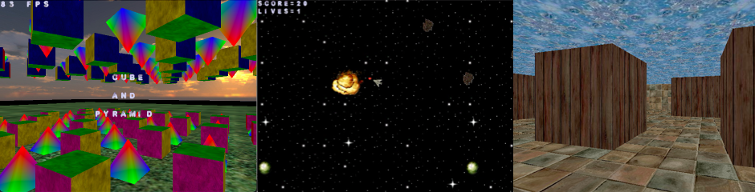
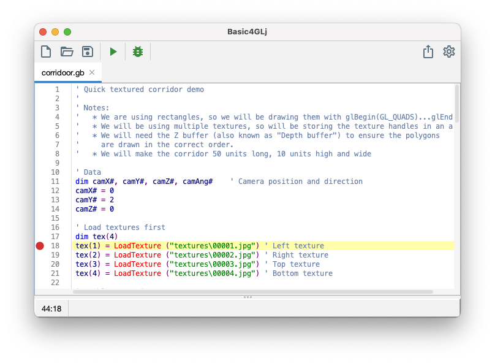

# Basic4GLj

_Cross-platform BASIC programming environment for 2D/3D game development - Java implementation of the Basic4GL compiler, runtime, and IDE._

[](https://nateisstalling.itch.io/basic4glj) 

---



---

Basic4GLj is a cross-platform Java implementation of Basic4GL, providing a programming environment for writing and running Basic4GL programs on Windows, Linux, and macOS.

## Features

- BASIC programming editor with syntax highlighting, autocomplete, and debugging
- Windows, Linux, and macOS support
- Built-in 2D sprite engine, sound, and networking support
- Plugin support for language extensions
- OpenGL 3D graphics
- Program export



## Getting Started

### Download the Latest Build

Download [Basic4GLj on itch.io](https://nateisstalling.itch.io/basic4glj), or visit the [GitHub Releases Page](https://github.com/NateIsStalling/Basic4GLj/releases) for the latest build.

### Sample Programs

Sample programs can be found in the `/samples` [folder](https://github.com/NateIsStalling/Basic4GLj/tree/main/samples/Programs).

Programs can be run by opening a `.gb` file in the Basic4GLj editor and clicking the Play button.

### Documentation

Check out the [docs](./docs) or [wiki](https://github.com/NateIsStalling/Basic4GLj/wiki) for the Basic4GL language guide, sprite library guide for 2D game programming, and additional tutorials.

- [Language Syntax Guide](./docs/basic4gl/language-syntax-guide.md)
- [Text Output Guide](./docs/basic4gl/text-output-guide.md)
- [Sprite Library Guide](./docs/basic4gl/sprite-library-guide.md)
- [OpenGL Guide](./docs/basic4gl/opengl-guide.md)
- [Sound Guide](./docs/basic4gl/sound-guide.md)

## Building the Editor

This project requires Java 17 and uses Gradle for its builds.

```shell
./gradlew :app:build
```

Build artifacts can be found in `/app/build/distributions`.

### Debugging the Editor

To build the required dependencies and launch the editor for debugging:

```shell
./gradlew :app:debugAll
```

The application depends on the JAR output of the `app-runtime` and `debug-server` modules. 
The `:app:debugAll` task builds these dependencies before launching the application.

## Compatibility Notes

Basic4GL's graphics functionality was originally built around OpenGL 1.1 and other legacy OpenGL APIs. Recent versions of Basic4GL use GLFW for windowing and OpenGL context management.

Basic4GLj aims to support the functionality provided by GLFW-based versions of Basic4GL. Some GLU functionality and legacy keyboard constants are not available through GLFW and LWJGL.

Please report any compatibility or stability issues to the Issues page of this project.

Additional compatibility notes can be found on the project's wiki: [Compatibility Notes](https://github.com/NateIsStalling/Basic4GLj/wiki/Compatibility-Notes)

## License

Basic4GLj is licensed under a **BSD 3-Clause license** - please see the LICENSES folder for more details and licenses for third-party libraries used.

## Credits

Basic4GLj is based on the source of Basic4GL by Tom Mulgrew. 
The source of the original C++ implementation can be found in the [Basic4GL GitHub repository](https://github.com/basic4gl-guy/basic4gl).
